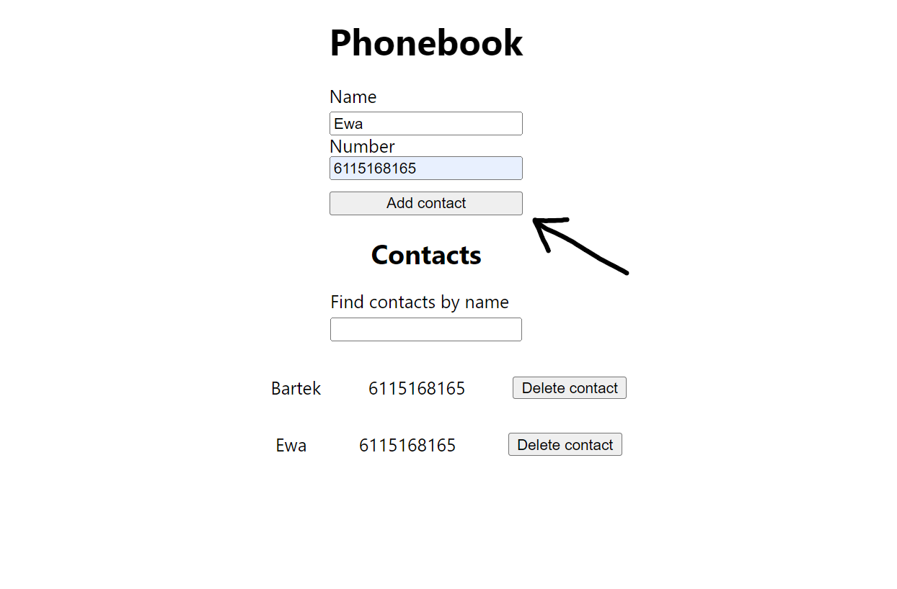
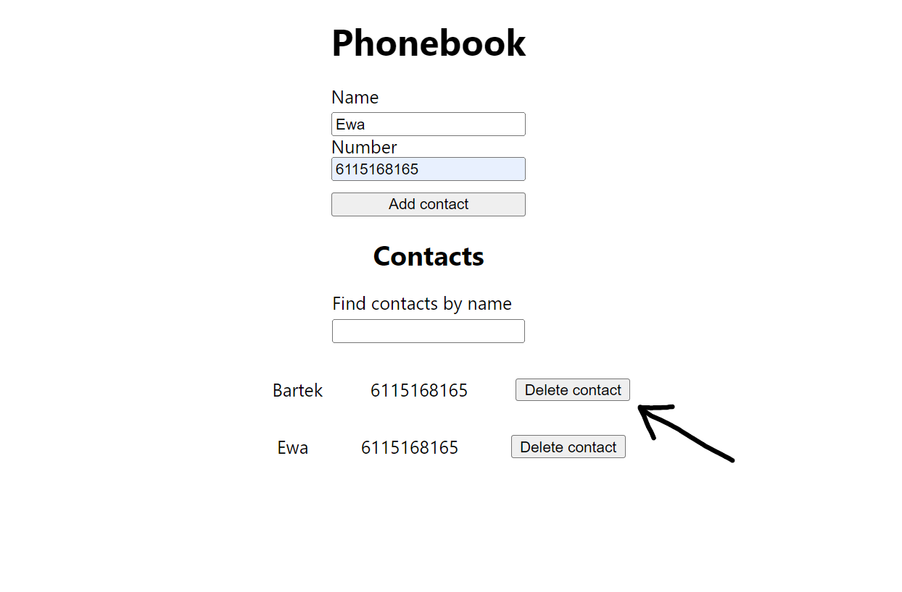
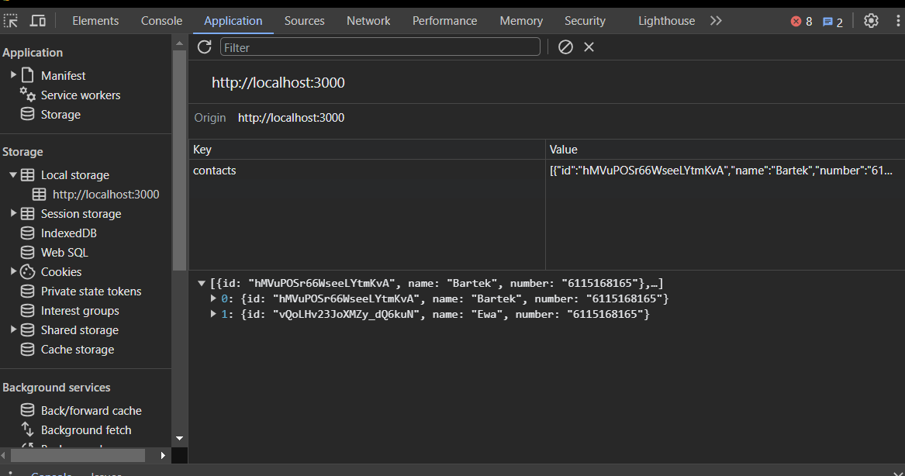

# Project Name

Application Phone book

## Table of Contents

- [General Info](#general-information)
- [Technologies Used](#technologies-used)
- [Setup](#setup)
- [Usage](#usage)
- [Project Status](#project-status)

## General Information

#### This application serve to do create of its own phone book.

## Technologies Used

Project is created with:

```
* React - version 18.1.0
* ReduX Toolkit - version 1.9.7
* React Hooks
* Nanoid - version 5.0.4
```

## Setup

<!-- To run this project, install it locally using npm:

```
npm install
npm install redux
npm install @reduxjs/toolkit react-redux
npm install @redux-devtools/extension
npm install nanoid
npm start
```

## Usage

With this application we can do:

Add contact to phone book



Remove contact from phone book



Save phone book in local storage



## Project Status

Project is in progress. Link to project:
https://bartosz-baranski.github.io/goit-react-hw-08-phonebook/ -->
